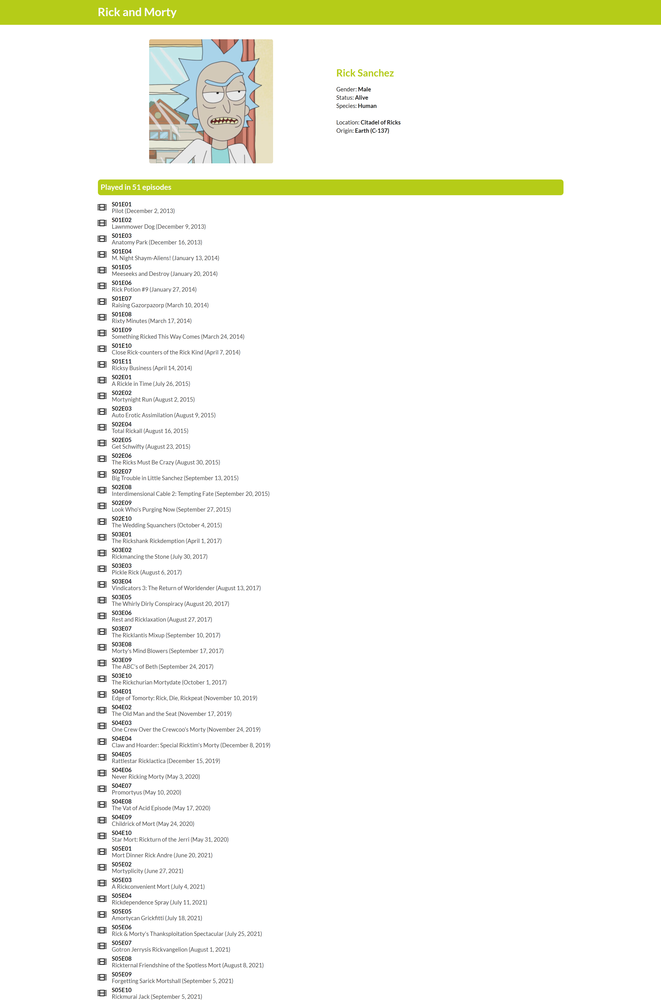

# Rick and Morty React app

## How to run project locally

```
npm install

npm run dev
```

App should be running at <http://localhost:5173>

## Pages

The application has 2 pages:

- Home page - contains paginated list of characters with option to filter them by status (`alive`, `dead` or `unknown`) and by gender (`female`, `male`, `genderless` or `unknown`) 

- Character page - displays detailed informations about a character 

## Technologies

- React.js (project created using Vite)
- TypeScript
- React Router
- Redux
- Semantic UI
